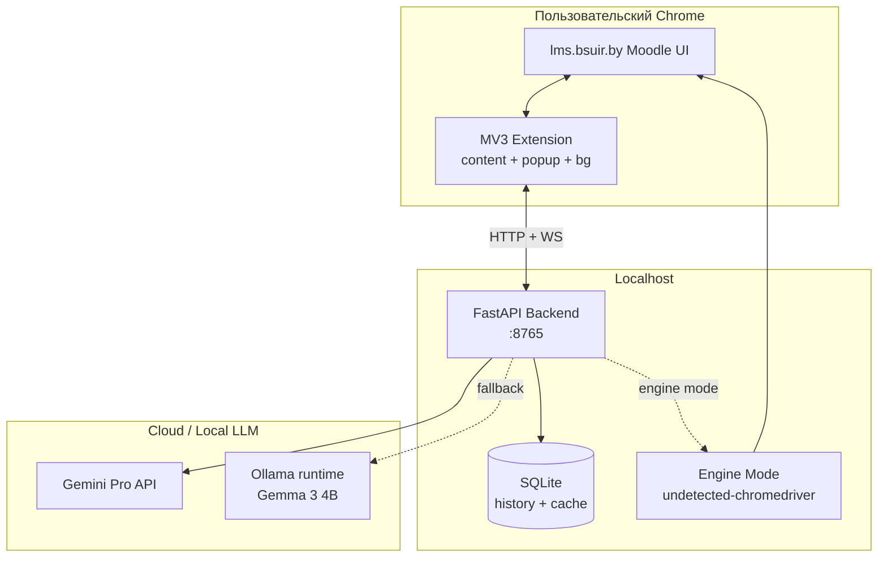
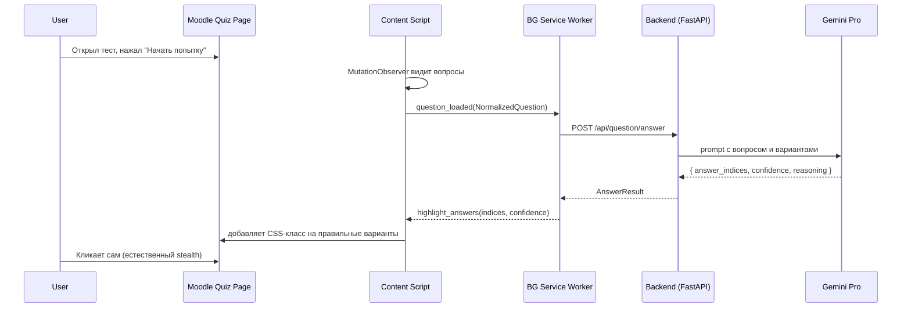
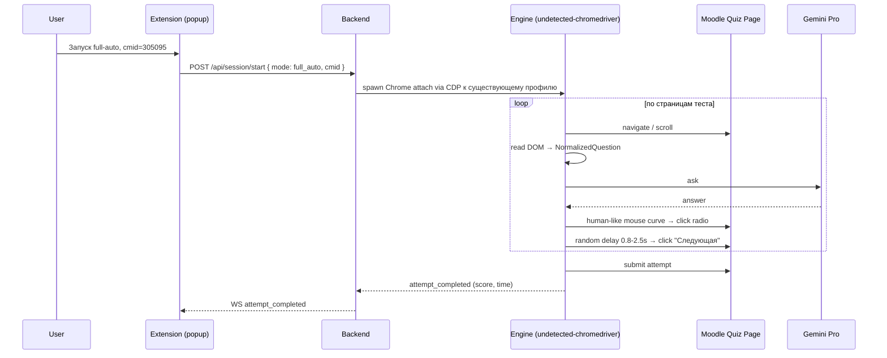

# Архитектура

## Обзор

Система состоит из двух деплоимых артефактов и внешних зависимостей:

1. **Chrome MV3 Extension** — UI, content scripts для разбора DOM Moodle,
   overlay-подсветка вариантов ответа, popup с настройками.
2. **Local Backend** (Python 3.12 + FastAPI) — AI-провайдер, история попыток
   (SQLite), engine-режим автоматизации через undetected-chromedriver,
   WebSocket для стрима событий.
3. **AI Provider** — Gemini Pro API (cloud) с fallback на локальную Gemma 3
   через Ollama.

Расширение и бэкенд общаются по HTTP+WebSocket на `127.0.0.1:8765`.
Расширение делает всю работу с DOM теста; бэкенд отвечает только за
"мозги" и хранилище. Это даёт максимальную стелс-незаметность для
основного use-case (расширение работает в реальной сессии пользователя
без любых внешних автоматизационных следов).

## Component diagram

## Высокоуровневые потоки

### Assist mode (рекомендуемый для пользователя)

### Full-auto mode (engine)

### Step-by-step mode

Гибрид. AI отвечает, ext показывает предложение в overlay над вариантом
("AI: вариант 2, 87% уверенности — Enter подтвердить, ← отменить"), ждёт
явный input от пользователя, затем имитирует клик сам или ждёт ручного
клика — в зависимости от подтверждения.

## Граница ответственности

| Что | Где |
|---|---|
| DOM-парсинг Moodle | Extension (content script) |
| Подсветка ответа в DOM | Extension (content script + injected CSS) |
| Имитация клика, mouse curves | Backend в engine-режиме; Extension в browser-режиме |
| HTTP-вызовы к AI | Backend (никогда не из расширения — CORS, скрытие ключа) |
| Хранение истории | Backend (SQLite) |
| Кеширование ответов | Backend (по SHA-256 хешу нормализованного вопроса) |
| Настройки пользователя | Extension (`chrome.storage.sync`) |
| Stealth-логика для engine | Backend (`backend/src/stealth/`) |

## Что вне scope MVP

См. [adr/0010-mvp-scope.md](adr/0010-mvp-scope.md). Кратко: изображения
(MathJax, схемы), текстовый ввод ответов, drag-and-drop вопросы,
локальная Gemma (отложена на Phase 1.5).

## Дальше

- Архитектурные решения и альтернативы → [adr/](adr/)
- Контракты API и форматы данных → [specs/](specs/)
- Запуск и структура кода → [DEVELOPMENT.md](DEVELOPMENT.md)
