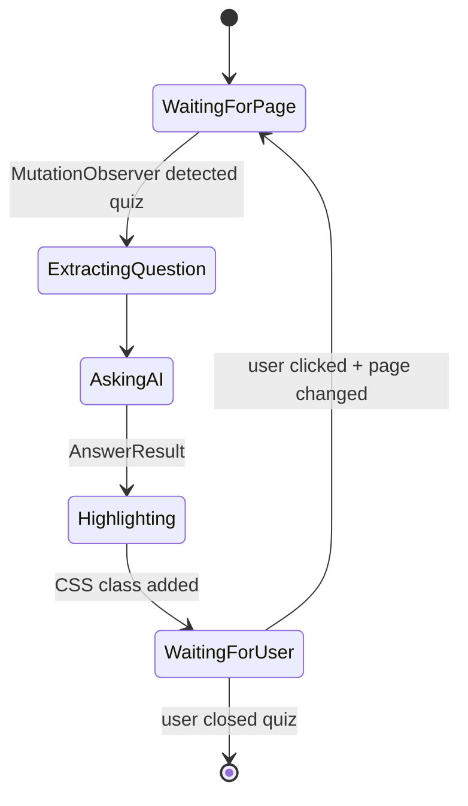
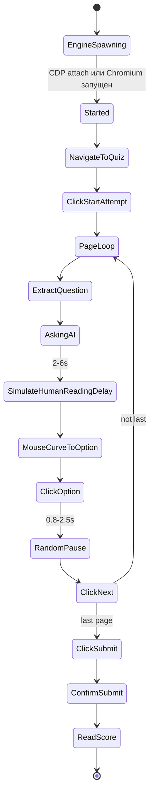
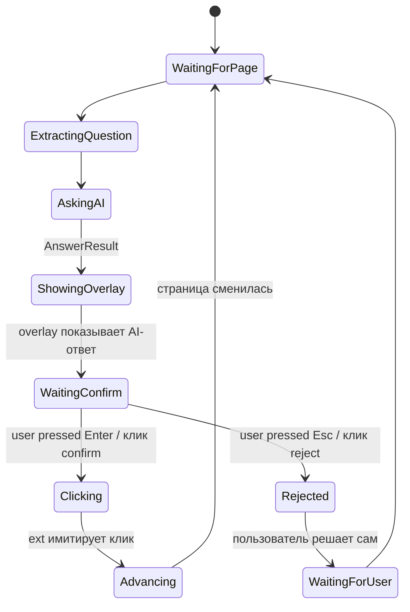

# ADR 0006: Режимы выполнения теста

## Status

Accepted, 2026-05-17

## Context

Пользователь имеет разные потребности:

- "Хочу учить — пусть AI подскажет, но я сам кликаю и читаю объяснения" → assist
- "У меня нет времени — пройди тест за меня" → full-auto
- "Пусть AI отвечает, но я подтверждаю каждый клик — на случай если он ошибётся" → step-by-step

Эти режимы влияют на:
- Где происходит клик (extension в реальном Chrome / engine во внешнем)
- Нужно ли подтверждение пользователя
- Уровень stealth (см. [0007](0007-stealth-strategy.md))

## Decision

Поддерживаем **три режима**: `assist`, `full_auto`, `step_by_step`. Режим
выбирается в popup расширения перед стартом сессии и не меняется во время.

### Режим 1: assist

**Поведение:**
- Content script парсит DOM, шлёт `NormalizedQuestion` на backend.
- Backend отвечает с `AnswerResult`.
- Content script добавляет CSS-класс `.lms-tool-suggested` на правильные
  `<label>` варианты — лёгкая зелёная подсветка с tooltip "AI: 87%".
- **Пользователь сам кликает**, сам жмёт "Следующая страница".
- Stealth — максимальный (никаких click events от автоматизации).

**UI в overlay:** в углу — индикатор уверенности AI ("87% — высокая",
"45% — низкая, проверь") и кнопка "Скрыть подсветку" для самопроверки.

### Режим 2: full_auto

**Поведение:**
- Engine = backend с undetected-chromedriver. Он либо подключается к
  Chrome пользователя по CDP, либо открывает свой stealth-Chromium.
- DOM-парсинг происходит в Python (своя реализация селекторов, дублирует
  TS-логику, см. [0008](0008-moodle-question-extraction.md)).
- Перед кликом — генерация Bezier-кривой движения мыши, random delays.
- После клика на radio — пауза 0.8-2.5s, потом "Следующая".
- На последней странице — "Отправить всё и завершить", подтверждение.
- Stealth — paranoid режим.

**UI в popup:** прогресс-бар "Вопрос 7/20, AI ответил, ждём 1.4s до клика",
кнопка "Pause/Resume", кнопка "Abort".

### Режим 3: step_by_step

**Поведение:**
- Как assist, но overlay не подсвечивает, а показывает модальное окно/тост
  "AI рекомендует вариант 3: 'Параметр X' (87% уверенности). [Enter] —
  кликнуть, [Esc] — отменить".
- После Enter content script сам имитирует клик: `scrollIntoView`,
  random delay, dispatch native MouseEvent. Юзер видит галочку.
- Если AI ошибается — Esc отменяет, пользователь выбирает сам, и ext
  не вмешивается до следующей страницы.
- Stealth — natural (см. ADR 0007), действия идут через настоящий Chrome.

### State machine на backend

Все три режима реализуются как state machine `SessionStateMachine` в
`backend/src/automation/session.py`. У каждой сессии — current state,
переходы через события из WS. Это упрощает тестирование (отправил event
→ проверил new state) и отладку.

### Прерывание / отмена

- В popup — кнопка "Stop". Она шлёт `POST /api/session/{id}/stop`.
- Backend останавливает engine (если запущен), закрывает WS, не отменяет
  уже сохранённые ответы — последний state остаётся в БД.

## Consequences

### Положительные
- Три уровня контроля покрывают разные ожидания пользователей.
- Один и тот же AI-pipeline для всех режимов — отличается только "руки"
  (где кликается).
- State machine делает легко добавлять новые режимы (например, "только
  логирование без ответов" для исследования).

### Отрицательные
- DOM-парсинг повторяется в TS и Python (для assist/step и для engine).
  Mitigation: единая JSON-схема `NormalizedQuestion`, общие fixture-тесты
  на одних HTML-сэмплах с обоих сторон.
- Engine-режим заметно сложнее в установке и отладке — рекомендовать
  пользователям сначала step_by_step.

## Alternatives considered

### Только два режима: ручной/авто
Слишком грубое разделение. Step-by-step — компромисс, который
по UX-исследованиям часто запрашивают пользователи AI-ассистентов.

### "Smart auto": AI решает сам кликнуть или попросить подтверждение
По confidence-порогу. Звучит хорошо, но: 1) confidence от LLM ненадёжен,
2) UX-непредсказуемость хуже, чем явный выбор режима. Отложено.

### Inline-режим вообще без popup
Только overlay на странице LMS. Хорошо для assist, но трудно для full-auto
(нужен прогресс-бар). Решено: popup как control panel + content script
как actuator.
