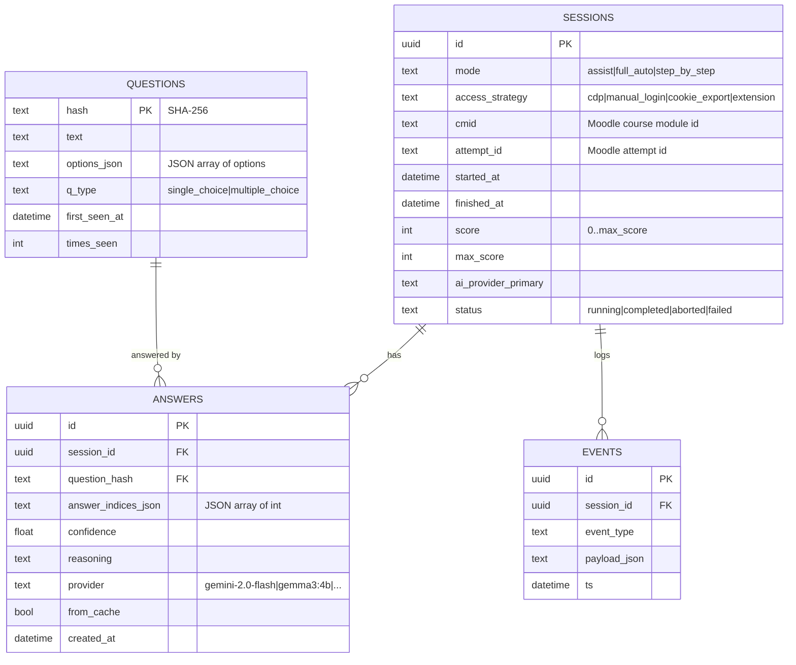

# ADR 0009: Хранилище данных

## Status

Accepted, 2026-05-17

## Context

Что нужно хранить:

1. **История попыток** — какие тесты, когда, score, длительность.
2. **Вопросы и ответы** — для последующего анализа точности AI, для
   возможности повторного использования.
3. **Кеш AI-ответов** — чтобы не дёргать Gemini API повторно на
   одинаковые вопросы.
4. **Настройки сессии** — какой режим использовался, какой провайдер.

Требования:
- Локально (privacy, см. [0001](0001-overall-architecture.md)).
- Просто в установке (без отдельного БД-сервера).
- Понятно EPAM-комиссии.
- Возможность экспорта (CSV, JSON) для отчёта.

## Decision

**SQLite через SQLAlchemy 2.0 + Alembic для миграций.**

Файл БД: `~/.local/share/lms-tool/quiz.db` (Linux XDG) или
`%LOCALAPPDATA%/lms-tool/quiz.db` (Windows). Путь конфигурируется через
`DATABASE_URL` env.

### Схема



### Таблица `sessions`
Одна строка на одну попытку прохождения теста. Не хранит chunked данные —
только агрегат и метаданные.

### Таблица `questions`
**Дедуплицированный** справочник вопросов. Один и тот же вопрос (по hash)
встречается в БД один раз, даже если повторяется в разных сессиях.
Поля `first_seen_at`, `times_seen` позволяют видеть "часто встречающиеся
вопросы" для оптимизации кеша.

### Таблица `answers`
Каждый AI-ответ — отдельная строка. `from_cache=true` означает, что ответ
взят из БД, а не от провайдера. Полезно для:
- Анализа: какие вопросы AI часто отвечает по кешу
- Метрик: cost saving от кеширования

### Таблица `events`
Опциональный аудитный лог. Может быть отключён через `LOG_EVENTS=false`
для скорости. По умолчанию пишем: `session_started`, `question_loaded`,
`answer_suggested`, `answer_confirmed`, `engine_clicked`,
`attempt_completed`, `error`.

### Кеш AI-ответов

Стратегия:

```python
async def answer_with_cache(q: NormalizedQuestion) -> AnswerResult:
    cached = db.find_recent_answer(q.hash, max_age=timedelta(days=30))
    if cached and cached.confidence > 0.7:
        return cached.as_result(from_cache=True)
    fresh = await ai_provider.answer(q)
    db.insert_answer(session_id, q.hash, fresh)
    return fresh
```

- Кеш только если последний ответ был `confidence > 0.7` (низкая
  уверенность — лучше переспросить).
- TTL 30 дней (на случай если AI обновилась и стала точнее).
- Кеш индексирован на `(question_hash, created_at DESC)` для быстрого
  поиска последнего ответа.

### Миграции

Alembic. Первая миграция `0001_initial.py` создаёт все 4 таблицы. При
добавлении полей — новые миграции, никогда не редактируем уже
применённые.

### Экспорт данных

CLI команда (или endpoint `/api/history/export`):

- `quiz.db` целиком — для backup
- CSV per session: вопрос, варианты, ответ AI, правильность (если LMS
  показал результат)
- JSON для programmatic access

### Privacy и cleanup

- БД лежит локально, нигде не синхронизируется.
- `quiz-tool reset` команда стирает все таблицы (для демо).
- `.gitignore` исключает `*.db`.

### Объём данных (оценка)

- 1 попытка ≈ 1 строка `sessions` + 20 строк `answers` + ~10 новых строк
  `questions` (10 уже в БД из прошлой попытки) + 100 `events`.
- 1000 попыток ≈ 130k строк. SQLite справляется тривиально, БД ~50 МБ.

## Consequences

### Положительные
- Никаких внешних зависимостей — установка проще.
- Полная история — для EPAM-демо можно показать графики "AI score за
  последние 20 попыток".
- Дедупликация вопросов экономит запросы.

### Отрицательные
- SQLite single-writer — при одновременном full_auto + assist в разных
  сессиях возможна блокировка. Для one-user use case это не проблема
  (мы single-tenant).
- SQLite не лучшее для full-text search. Если в Phase 4 захотим "найти
  все вопросы про XYZ" — добавим FTS5 виртуальную таблицу или мигрируем
  на Postgres.

## Alternatives considered

### Postgres
Overkill для local single-user. SQLite + SQLAlchemy позволяет в Phase 5
сменить URL на Postgres почти без кода.

### JSON files на диске
Просто, но: нет атомарности на write, поиск/группировка вручную,
дедупликация сложная. SQLite + ORM проще.

### NoSQL (TinyDB, MongoDB)
Не нужна гибкая схема — структура вопросов/ответов фиксированная.
Реляционная модель естественна.

### Хранить в DuckDB
Хорошо для аналитики, хуже для transactional writes. Можно использовать
для экспортного слоя в Phase 4 (DuckDB читает SQLite напрямую через
ATTACH).
